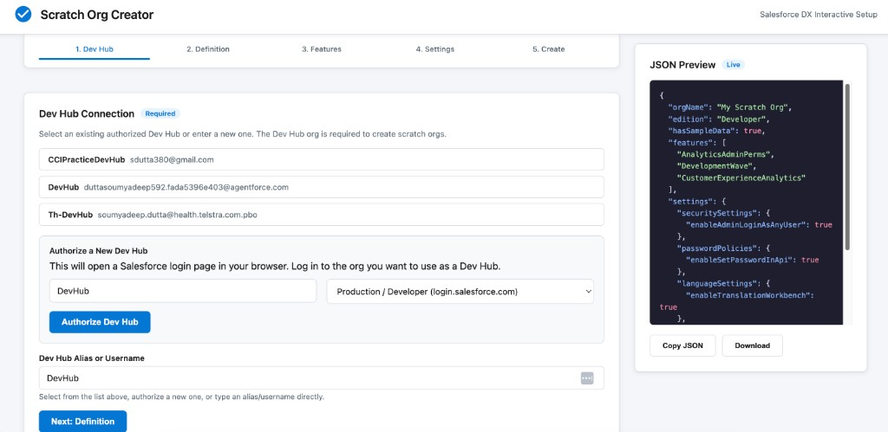
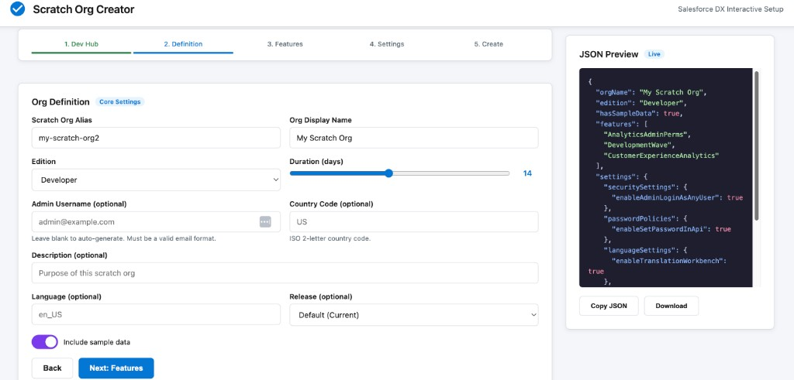
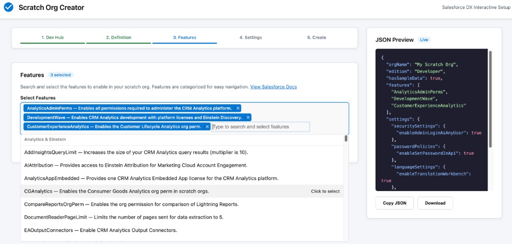
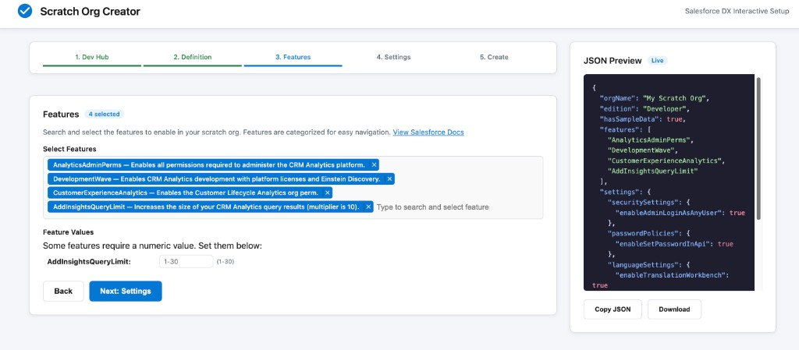
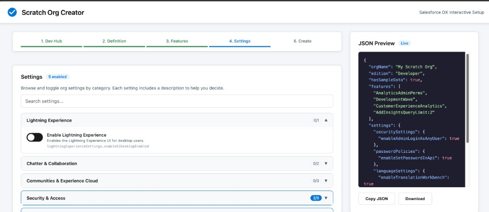
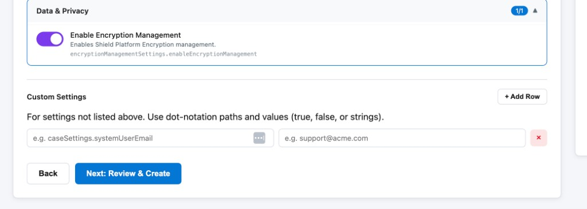
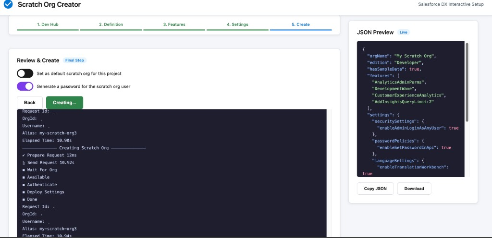

# Scratch Org Creator — User Guide

A step-by-step walkthrough for creating Salesforce scratch orgs using the interactive web UI.

---

## Prerequisites

Before you begin, make sure you have the following installed and ready:

| # | Requirement | How to Check | How to Install |
|---|-------------|--------------|----------------|
| 1 | **Salesforce CLI (`sf`)** | Run `sf --version` in terminal | [Install Guide](https://developer.salesforce.com/tools/salesforcecli) or `npm install -g @salesforce/cli` |
| 2 | **Python 3** | Run `python3 --version` in terminal | Pre-installed on macOS. Windows: [python.org](https://www.python.org/downloads/) |
| 3 | **Dev Hub Enabled** | In your Salesforce org: Setup → Dev Hub → Should show "Enabled" | Setup → Dev Hub → Toggle "Enable Dev Hub" to ON |
| 4 | **Web Browser** | Any modern browser (Chrome, Safari, Firefox, Edge) | Already available on your machine |

### Files You Need

You only need **one file** to get started:

| File | Description |
|------|-------------|
| `scratch-org-creator.sh` | The self-contained installer (single file, ~191 KB). Contains everything needed. |

**OR** if working from the repository:

| File/Folder | Description |
|-------------|-------------|
| `create-scratch-org.sh` | Main launcher script |
| `scratch-org-ui/` | Folder containing the web app (app.py, features.json, settings.json, templates/) |

---

## Getting Started

Open your terminal and run:

```bash
bash scratch-org-creator.sh
```

Or if using the repository version:

```bash
bash create-scratch-org.sh
```

The tool will:
1. Check that Python 3 and Salesforce CLI are installed
2. Install Flask automatically (first time only)
3. Start a local web server
4. Open your browser to the interactive UI

You'll see output like:
```
╔══════════════════════════════════════╗
║      Scratch Org Creator  v1.0       ║
╚══════════════════════════════════════╝

[i] Starting web server on http://localhost:8484 ...
[✓] Web UI running at: http://localhost:8484

Press Ctrl+C to stop the server when done.
```

---

## Step 1: Select Your Dev Hub



**What is a Dev Hub?**
A Dev Hub is the Salesforce org that manages your scratch orgs. You must authorize one before creating scratch orgs.

**What to do:**

1. **If you see your Dev Hub listed** (as shown above with "CCIPracticeDevHub", "DevHub", "Th-DevHub") — click on it to select it. The alias will auto-fill in the "Dev Hub Alias or Username" field below.

2. **If no Dev Hubs are listed** — use the "Authorize a New Dev Hub" section:
   - Enter an alias (e.g., "MyDevHub")
   - Select login type: "Production / Developer" for production orgs, "Sandbox" for sandboxes
   - Click **Authorize Dev Hub**
   - A Salesforce login page will open in your browser — log in and authorize
   - Once done, your Dev Hub will appear in the list

3. Click **Next: Definition** to proceed.

---

## Step 2: Configure Org Definition



**What to do:**

| Field | What to Enter | Required? |
|-------|---------------|-----------|
| **Scratch Org Alias** | A short name for your org (e.g., "my-scratch-org2") | Yes |
| **Org Display Name** | Human-readable name | Yes |
| **Edition** | Select from Developer, Enterprise, Group, Professional | Yes |
| **Duration (days)** | How long the org should last (1-30 days). Drag the slider. | Yes |
| **Admin Username** | Leave blank to auto-generate, or enter a valid email | No |
| **Country Code** | 2-letter country code (e.g., "US", "IN", "AU") | No |
| **Description** | Purpose of the scratch org | No |
| **Language** | Language code (e.g., "en_US") | No |
| **Release** | Default (Current), Previous, or Preview (Next) | No |
| **Include sample data** | Toggle ON to include sample records | No |

**Tips:**
- Duration of 7-14 days is common for development
- Use "Developer" edition for most development work
- "Enterprise" edition is needed if testing Enterprise-specific features

Click **Next: Features** to proceed.

---

## Step 3: Select Features



**What are Features?**
Features enable specific Salesforce capabilities in your scratch org (e.g., Analytics, Communities, Service Cloud). There are 296 features available, organized by category.

**What to do:**

1. **Click on the search box** — it says "Type to search and select features"
2. **Type to search** — e.g., type "Analytics" to find analytics-related features
3. **Click a feature** to add it — it appears as a blue tag in the search box
4. **Remove a feature** by clicking the × on its tag

Features are grouped by category (Analytics & Einstein, Sales Cloud, Service Cloud, etc.) making it easy to browse.

### Features That Need Values



Some features require a numeric value. For example:
- **AddInsightsQueryLimit** — needs a value between 1-30

When you select such a feature, a "Feature Values" section appears below with input fields showing the valid range.

**The JSON Preview** on the right updates in real-time showing exactly what will be included in your scratch org definition.

Click **Next: Settings** to proceed.

---

## Step 4: Configure Settings



**What are Settings?**
Settings control specific org behaviors — like enabling Lightning Experience, Chatter, encryption, etc.

**What to do:**

1. **Browse categories** — Click on any category header (Lightning Experience, Chatter & Collaboration, Security & Access, etc.) to expand it
2. **Toggle settings ON/OFF** — Each setting has a toggle switch:
   - **Dark (off)** = setting not included
   - **Purple/Blue (on)** = setting will be enabled
3. **Use the search bar** — Type to filter settings across all categories
4. **Check the counter** — The badge (e.g., "2/3") shows how many settings are enabled in each category

The "5 enabled" badge at the top shows total active settings.

### Custom Settings



For settings not listed in the pre-built categories:

1. Click **+ Add Row**
2. Enter the **dot-notation path** (e.g., `caseSettings.systemUserEmail`)
3. Enter the **value** (e.g., `support@acme.com`, `true`, `false`, or any string)
4. Add more rows as needed
5. Click × to remove a row

Click **Next: Review & Create** to proceed.

---

## Step 5: Review & Create



**What to do:**

1. **Review the JSON Preview** on the right — this is exactly what will be saved as your scratch org definition file

2. **Configure options:**
   - **Set as default scratch org** — Toggle ON if this should be your active org for the project
   - **Generate a password** — Toggle ON to auto-generate login credentials

3. **Click "Create Scratch Org"** — The button turns to "Creating..." and live console output appears below

**What happens during creation:**
- The definition JSON is saved to `scratch-orgs-templates/`
- The `sf org create scratch` command runs
- You'll see real-time progress:
  - "Prepare Request"
  - "Send Request" (takes ~10-15 seconds)
  - "Wait For Org"
  - "Available"
  - "Authenticate"
  - "Deploy Settings"
  - "Done"

4. **After creation completes:**
   - A green success card appears with your org credentials (username, password, instance URL)
   - An "Open Org in Browser" button lets you jump straight into the org

---

## After Creation

Once your scratch org is created, you can:

| Action | How |
|--------|-----|
| Open the org | Click "Open Org in Browser" button |
| Copy credentials | Note the username, password, and instance URL from the success card |
| View the definition file | Check `scratch-orgs-templates/` folder |
| Create another org | Refresh the page or restart the script |
| Stop the server | Press `Ctrl+C` in the terminal |

---

## Session Recovery

If you accidentally close the browser or the server stops mid-way:

- **Your progress is automatically saved** — All form data (Dev Hub, alias, features, settings) is stored locally
- **Just restart the script** — Run `bash scratch-org-creator.sh` again
- **Your previous selections are restored** — A "Session Restored" banner appears, and you're returned to the step you were on

To start fresh, click "Start Fresh" on the restore banner.

---

## Troubleshooting

| Problem | Solution |
|---------|----------|
| "sf command not found" | Install Salesforce CLI: `npm install -g @salesforce/cli` |
| "python3 not found" | Install Python 3 from [python.org](https://www.python.org/downloads/) |
| "Could not install Flask" | Run manually: `pip3 install flask` |
| Browser doesn't open | Copy the URL from terminal output and open manually |
| "Dev Hub is not enabled" | In your Salesforce org: Setup → Dev Hub → Toggle ON |
| Org creation fails | Check the error in the console output — common issues: expired Dev Hub auth, invalid features |
| Page looks outdated | Press `Cmd+Shift+R` (Mac) or `Ctrl+Shift+R` (Windows) to hard reload |
| Port already in use | Kill any existing servers: `kill $(lsof -t -i:8484)` then retry |

---

## Quick Reference Card

```
Start:          bash scratch-org-creator.sh
Stop:           Ctrl+C in terminal
Force update:   bash scratch-org-creator.sh --update
Help:           bash scratch-org-creator.sh --help
```

**Typical workflow time: 2-3 minutes** from start to a running scratch org.
